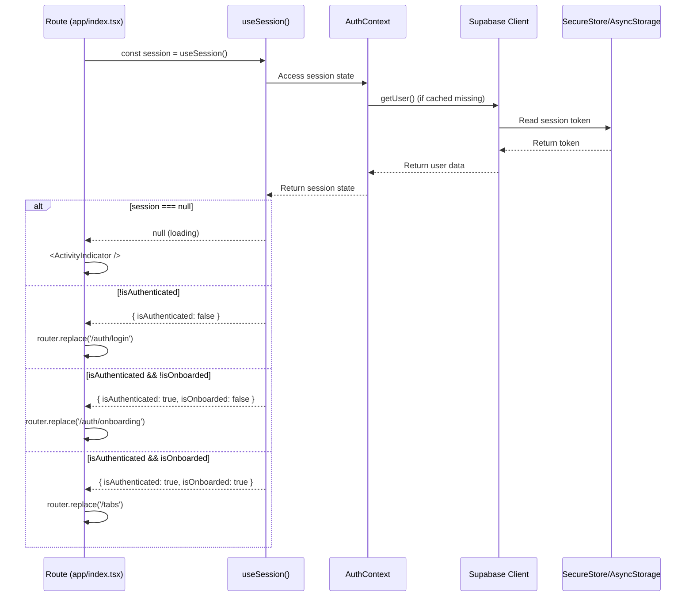
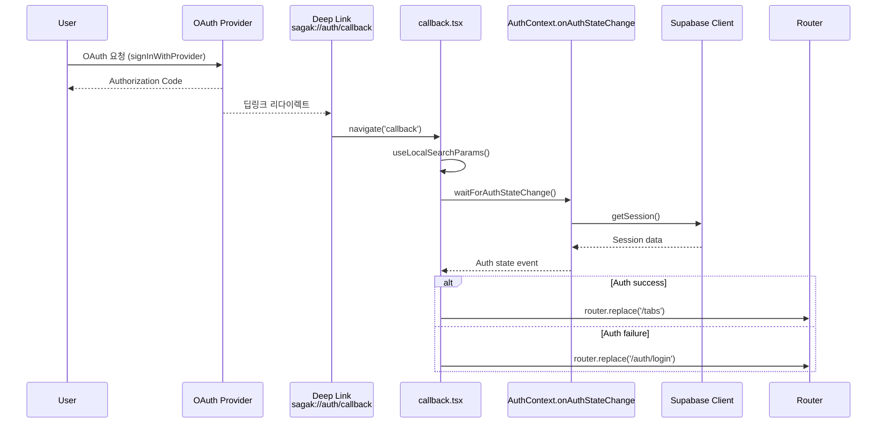
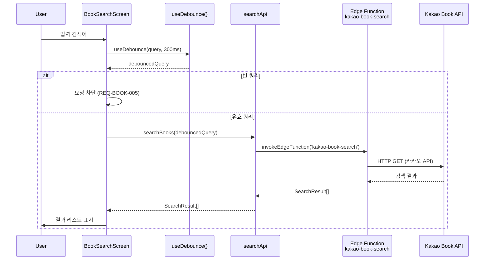
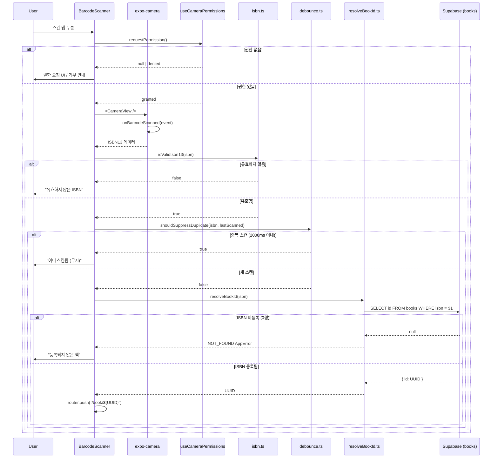
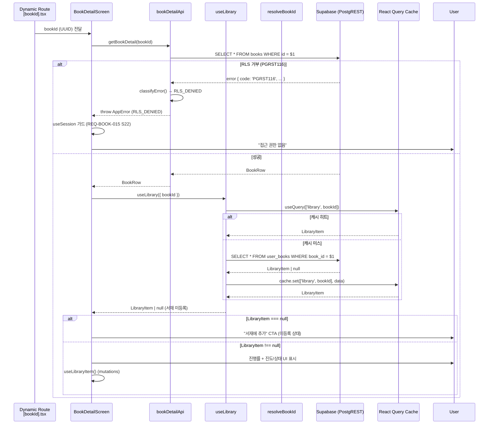
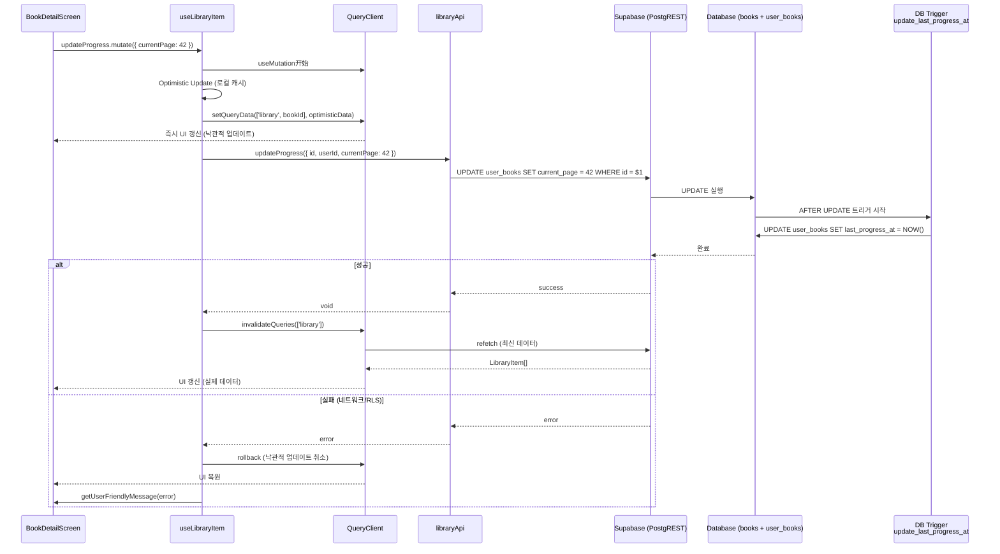
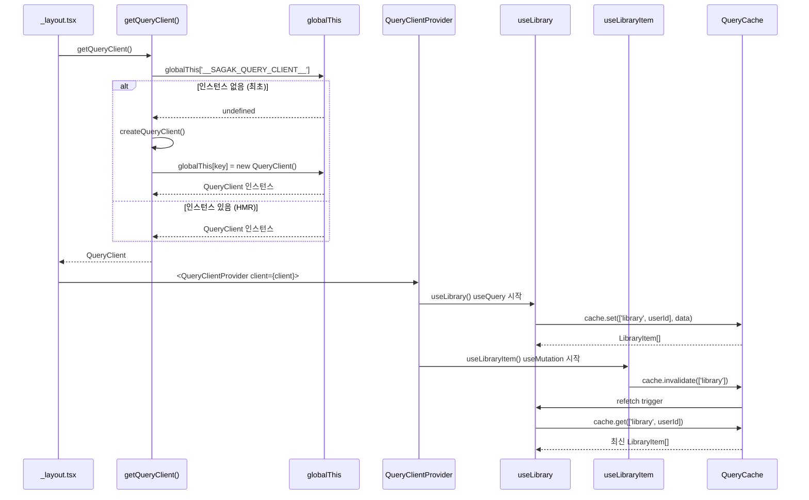
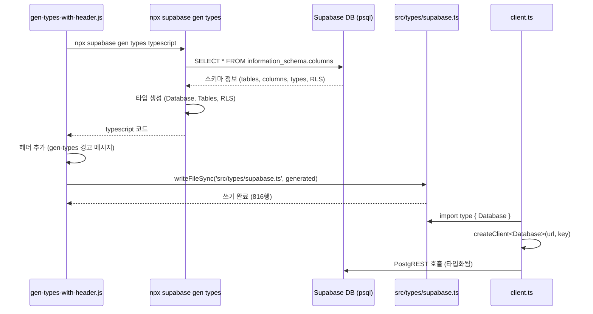

# Sa-gak Data Flow Paths

주요 데이터 흐름 — 인증 가드, OAuth 딥링크, 테마, 세션 지속성, 도서 검색/상세 조회 API(M1/M2) + 수동 검색/바코드 스캔/상세 UI(M3/M4) + 서재/진행률/ISBN→UUID 매핑(LIBRARY-001)

## 1. Auth Guard Flow

**목적:** 인증/온보딩 상태에 따른 라우팅 분기

**진입점:** `app/index.tsx`, `app/(tabs)/_layout.tsx`, `app/(auth)/_layout.tsx`



### State Transitions

| 상태 | 조건 | 액션 | 다음 상태 |
|------|------|------|----------|
| `null` | 초기 로딩 중 | `<ActivityIndicator />` | 로딩 완료 시 `{session, user, profile, ...}` 또는 `{session: null, user: null, profile: null, loading: false}` |
| `{ isAuthenticated: false }` | 세션 없음 | `router.replace('/auth/login')` | 로그인 성공 시 `{ isAuthenticated: true, isOnboarded: ? }` |
| `{ isAuthenticated: true, isOnboarded: false }` | 온보딩 안 됨 | `router.replace('/auth/onboarding')` | 온보딩 완료 시 `{ isAuthenticated: true, isOnboarded: true }` |
| `{ isAuthenticated: true, isOnboarded: true }` | 모든 조건 충족 | `router.replace('/tabs')` | 메인 앱 진입 |

### Key Implementation

**File:** `src/auth/useSession.ts`

```typescript
export function useSession() {
  const context = useContext(AuthContext)

  if (context === undefined) {
    throw new Error('useSession must be used within AuthProvider')
  }

  return context.session
}
```

**반환값 타입:**
```typescript
type SessionState = null | {
  session: Session | null
  user: User | null
  profile: UserProfile | null
  loading: boolean
  isAuthenticated: boolean
  isOnboarded: boolean
  signInWithProvider: (provider: 'kakao' | 'apple' | 'google') => Promise<void>
  signOut: () => Promise<void>
  refreshProfile: () => Promise<void>
}
```

---

## 2. OAuth Deep-link Flow

**목적:** OAuth 제공자(Kakao/Apple/Google)에서 인증 후 앱으로 복귀

**진입점:** `app/(auth)/auth/callback.tsx`



### Key Implementation

**File:** `app/(auth)/auth/callback.tsx`

```typescript
const { accessToken, refreshToken, error } = useLocalSearchParams()

useEffect(() => {
  const waitForAuth = async () => {
    const { data } = await supabase.auth.getSession()
    if (data.session) {
      router.replace('/tabs')
    } else {
      router.replace('/auth/login')
    }
  }
  waitForAuth()
}, [])
```

---

## 3. Book Search Flow (수동 검색)

**목적:** 도서 검색어 → 카카오 책 검색 API → 검색 결과 표시

**진입점:** `app/(tabs)/search.tsx` → `src/features/book/BookSearchScreen.tsx`



### Key Implementation

**File:** `src/features/book/searchApi.ts`

```typescript
export async function searchBooks(
  query: string,
  target: SearchTarget = 'all'
): Promise<SearchResult[]> {
  if (!query.trim()) {
    return [] // 빈 쿼리 차단 (REQ-BOOK-005)
  }

  const { data, error } = await invokeEdgeFunction('kakao-book-search', {
    query,
    target
  })

  if (error) throw normalizeError(error)
  return data as SearchResult[]
}
```

---

## 4. Barcode Scan Flow (ISBN 스캔)

**목적:** 카메라 → 바코드 스캔 → ISBN 검증 → resolveBookId → 서재 등록 또는 상세 진입

**진입점:** `app/(tabs)/scan.tsx` → `src/features/book/BarcodeScanner.tsx`



### Key Implementation

**File:** `src/features/book/resolveBookId.ts` (SPEC-LIBRARY-001 TASK-002)

```typescript
export async function resolveBookId(isbn: string): Promise<string> {
  const client = getSupabaseClient()

  const result = await client
    .from('books')
    .select('id')
    .eq('isbn', isbn)
    .maybeSingle()

  if (result.error) throw normalizeError(result.error)
  if (!result.data) {
    throw new AppError(`등록되지 않은 ISBN: ${isbn}`, 'NOT_FOUND', 404)
  }

  return result.data.id
}
```

**특이사항:**
- `maybeSingle()` 사용: 0행 → `data: null` (NOT_ERROR), 1행 → `data: {id}`
- ISBN은 UNIQUE 제약조건이므로 최대 1행 보장
- 미등록 ISBN은 에러가 아닌 "책을 서재에 추가" UI로 연결하는 흐름 (BookDetailScreen)

---

## 5. Book Detail Flow (상세 + 서재 통합)

**목적:** 도서 상세 + 서재 진행률 표시 + 진도/상태 mutation

**진입점:** `app/(tabs)/[bookId].tsx` → `src/features/book/BookDetailScreen.tsx`



### Key Implementation

**File:** `src/features/book/BookDetailScreen.tsx`

```typescript
const { data: book, isLoading: bookLoading, error: bookError } = useQuery({
  queryKey: ['book', bookId],
  queryFn: () => getBookDetail(bookId),
})

const { data: libraryItem } = useLibrary({
  bookId,
  enabled: !!book, // book 로딩 완료 후 서재 조회
})

const updateProgress = useLibraryItem('progress')
const updateStatus = useLibraryItem('status')
```

**특이사항:**
- `getBookDetail`와 `useLibrary` 병렬 실행 가능하지만, 서재 조회는 `enabled: !!book`으로 book 로딩 완료 후 진행
- `resolveBookId`는 스캔 흐름에서만 호출되고, 여기서는 UUID 직접 사용

---

## 6. Library Mutation Flow (서재 진도/상태 업데이트)

**목적:** 서재 항목의 진도/상태/공개여부 업데이트 + React Query 캐시 무효화

**진입점:** `src/features/library/useLibraryItem.ts`



### Key Implementation

**File:** `src/features/library/useLibraryItem.ts`

```typescript
export function useLibraryItem(type: 'progress' | 'status' | 'visibility') {
  const queryClient = useQueryClient()

  return useMutation({
    mutationFn: (input) => {
      switch (type) {
        case 'progress':
          return updateProgress(input)
        case 'status':
          return updateStatus(input)
        case 'visibility':
          return updateVisibility(input)
      }
    },
    onMutate: async (variables) => {
      // Optimistic update
      queryClient.setQueryData(['library', variables.bookId], (old) => ({
        ...old,
        [type === 'progress' ? 'currentPage' : type]: variables.value
      }))
    },
    onError: (error) => {
      // Rollback on error
      queryClient.invalidateQueries(['library'])
    },
    onSuccess: () => {
      // Refetch on success
      queryClient.invalidateQueries(['library'])
    }
  })
}
```

**특이사항:**
- `last_progress_at`은 DB 트리거가 관리하므로, `updateProgress` payload에는 포함하지 않음 (AC-TRIG-001)
- 낙관적 업데이트 실패 시 자동 롤백
- `invalidateQueries(['library'])`로 관련 캐시 무효화

---

## 7. Query Infrastructure Flow (React Query 캐싱)

**목적:** 앱 전역 React Query 싱글톤 → 캐시 공유 + HMR 안정성

**진입점:** `app/_layout.tsx` → `src/lib/query/queryClient.ts`



### Key Implementation

**File:** `src/lib/query/queryClient.ts` (SPEC-LIBRARY-001 TASK-001)

```typescript
const QUERY_CLIENT_KEY = '__SAGAK_QUERY_CLIENT__'

export function getQueryClient(): QueryClient {
  const holder = globalThis as QueryClientHolder
  if (!holder[QUERY_CLIENT_KEY]) {
    holder[QUERY_CLIENT_KEY] = createQueryClient()
  }
  return holder[QUERY_CLIENT_KEY]
}

function createQueryClient(): QueryClient {
  return new QueryClient({
    defaultOptions: {
      queries: {
        staleTime: 0, // 즉시 stale (네트워크 우선 전략)
        retry: 1,
        refetchOnWindowFocus: false,
      },
      mutations: {
        retry: 0,
      },
    },
  })
}
```

**특이사항:**
- `globalThis` 캐시로 HMR 중 인스턴스 중복 생성 방지 (TanStack 공식 패턴)
- `staleTime: 0` 설정으로 서재/진행률 데이터는 네트워크 우선 (최신성 중요)
- 테스트용 `resetQueryClient()`로 싱글톤 초기화 지원

---

## 8. gen-types Pipeline Flow (Supabase 타입 자동생성)

**목적:** Supabase DB 스키마 → TypeScript 타입 자동생성 (816행 supabase.ts)

**진입점:** `scripts/gen-types-with-header.js` → `src/types/supabase.ts`



### Key Implementation

**File:** `scripts/gen-types-with-header.js`

```javascript
const { execSync } = require('child_process')
const fs = require('fs')

const header = `/**
 * Supabase 타입 정의 (자동생성됨)
 *
 * 생성 명령어: npx supabase gen types typescript --linked
 * 수정 금지: DB 스키마 변경 시 gen-types-with-header.js 재실행
 */

const generated = execSync('npx supabase gen types typescript --linked').toString()

fs.writeFileSync('src/types/supabase.ts', header + generated)
```

**File:** `src/lib/supabase/client.ts`

```typescript
import type { Database } from '../../types/supabase'
import { createClient } from '@supabase/supabase-js'

export function getSupabaseClient() {
  return createClient<Database>(
    process.env.SUPABASE_URL!,
    process.env.SUPABASE_ANON_KEY!
  )
}
```

**특이사항:**
- `Database` 제네릭으로 PostgREST 쿼리 타입화
- `books.select('id')` → 반환 타입 `{ id: string }[]` 자동 추론
- RLS 정책 타입 포함 (RLS_DENIED 등)

---

## Data Flow Summary

| Flow | Entry | Key Modules | External APIs | Cache Strategy |
|------|-------|-------------|----------------|----------------|
| Auth Guard | `app/index.tsx` | useSession, AuthContext | Supabase Auth | Session (SecureStore) |
| OAuth Deep-link | `app/(auth)/auth/callback.tsx` | AuthContext.onAuthStateChange | Supabase Auth | Session (SecureStore) |
| Book Search | `app/(tabs)/search.tsx` | BookSearchScreen, searchApi | Kakao Book API (Edge) | React Query |
| Barcode Scan | `app/(tabs)/scan.tsx` | BarcodeScanner, resolveBookId | Supabase (books) | - |
| Book Detail | `app/(tabs)/[bookId].tsx` | BookDetailScreen, useLibrary | Supabase (PostgREST) | React Query |
| Library Mutation | `BookDetailScreen` | useLibraryItem, libraryApi | Supabase (PostgREST + Trigger) | React Query (optimistic) |
| Query Infrastructure | `app/_layout.tsx` | getQueryClient | - | globalThis 싱글톤 |
| gen-types Pipeline | `scripts/gen-types-with-header.js` | CLI, client.ts | Supabase DB | - |
