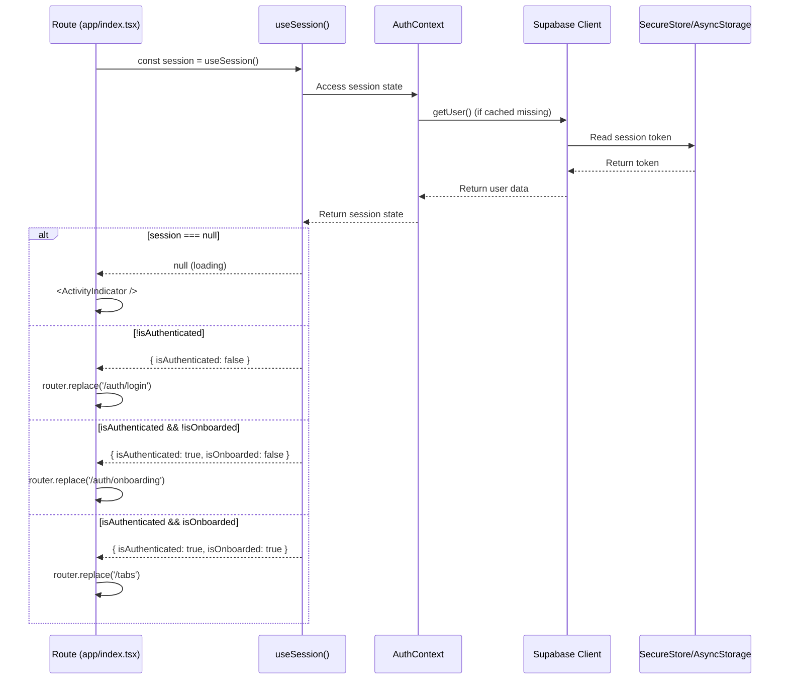
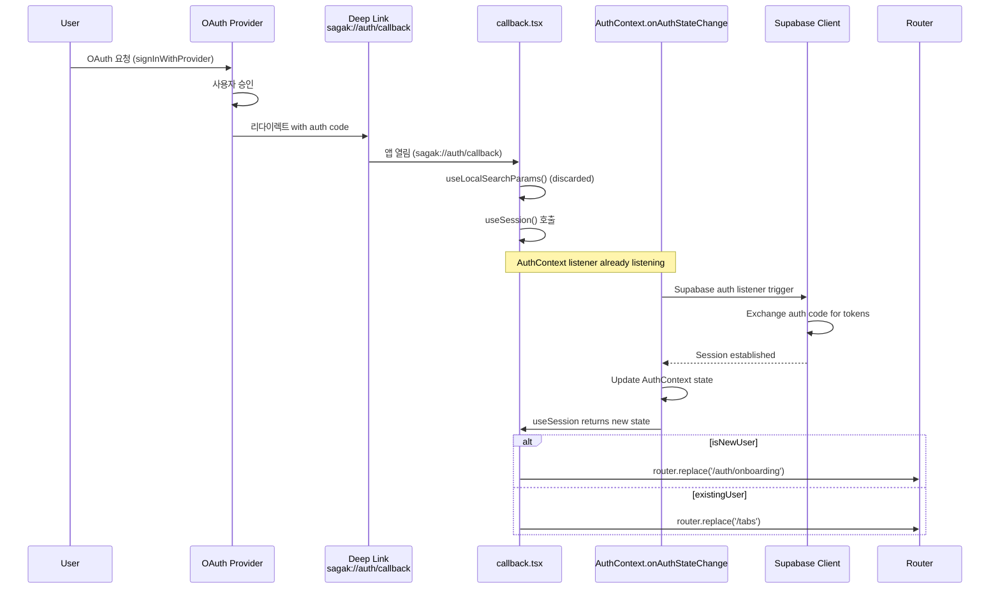
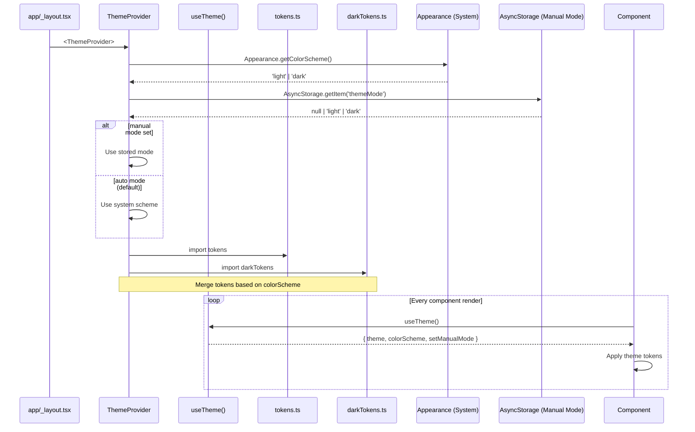
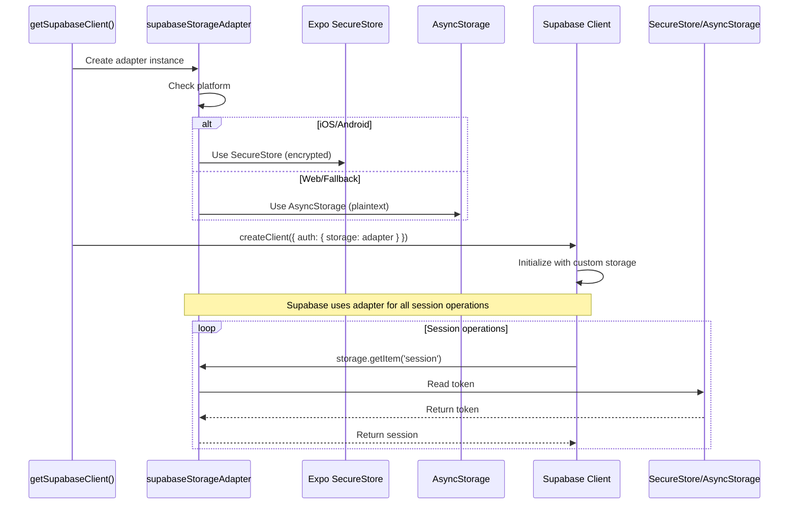
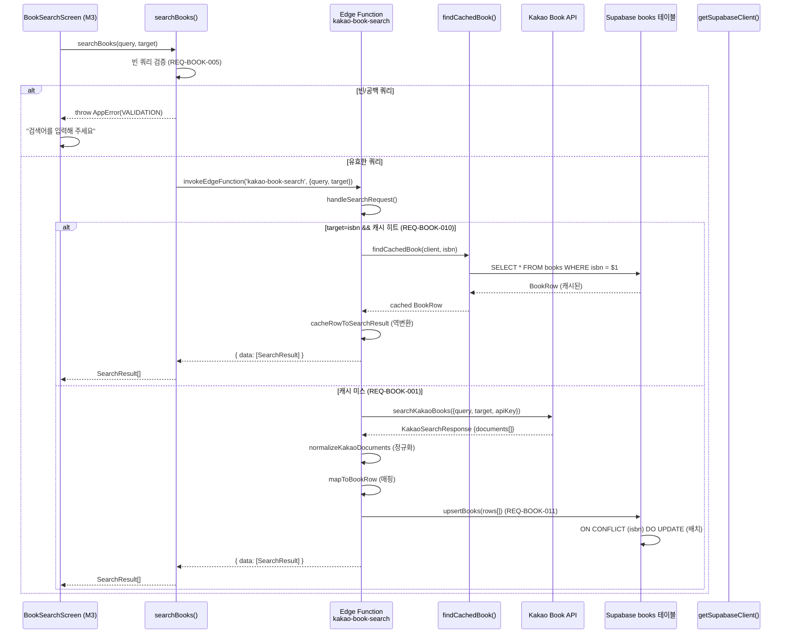
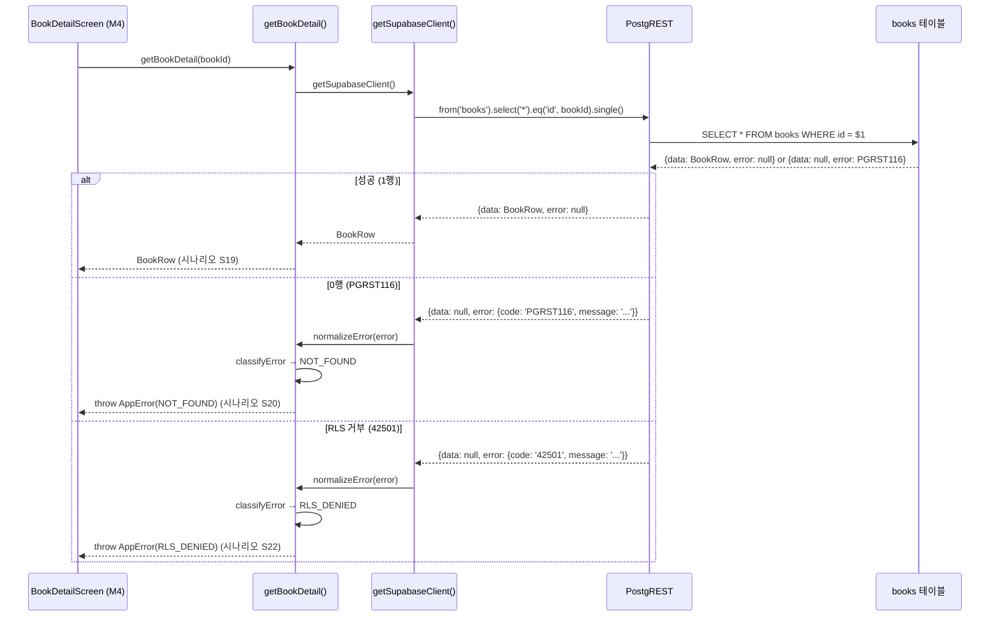

# Sa-gak Data Flow Paths

주요 데이터 흐름 — 인증 가드, OAuth 딥링크, 테마, 세션 지속성, 도서 검색 및 상세 조회 (BOOK 모듈 추가)

## 1. Auth Guard Flow

**목적:** 인증/온보딩 상태에 따른 라우팅 분기

**진입점:** `app/index.tsx`, `app/(tabs)/_layout.tsx`, `app/(auth)/_layout.tsx`



### State Transitions

| 상태 | 조건 | 액션 | 다음 상태 |
|------|------|------|----------|
| `null` | 초기 로딩 중 | `<ActivityIndicator />` | 로딩 완료 시 `{session, user, profile, ...}` 또는 `{session: null, user: null, profile: null, loading: false}` |
| `{ isAuthenticated: false }` | 세션 없음 | `router.replace('/auth/login')` | 로그인 성공 시 `{ isAuthenticated: true, isOnboarded: ? }` |
| `{ isAuthenticated: true, isOnboarded: false }` | 온보딩 안 됨 | `router.replace('/auth/onboarding')` | 온보딩 완료 시 `{ isAuthenticated: true, isOnboarded: true }` |
| `{ isAuthenticated: true, isOnboarded: true }` | 모든 조건 충족 | `router.replace('/tabs')` | 메인 앱 진입 |

### Key Implementation

**File:** `src/auth/useSession.ts`

```typescript
export function useSession() {
  const context = useContext(AuthContext)
  
  if (context === undefined) {
    throw new Error('useSession must be used within AuthProvider')
  }
  
  return context.session
}
```

**반환값 타입:**
```typescript
type SessionState = null | {
  session: Session | null
  user: User | null
  profile: UserProfile | null
  loading: boolean
  isAuthenticated: boolean
  isOnboarded: boolean
  signInWithProvider: (provider: 'kakao' | 'apple' | 'google') => Promise<void>
  signOut: () => Promise<void>
  refreshProfile: () => Promise<void>
}
```

---

## 2. OAuth Deep-link Flow

**목적:** OAuth 제공자(Kakao/Apple/Google)에서 인증 후 앱으로 복귀

**진입점:** `app/(auth)/auth/callback.tsx`



### Key Implementation

**File:** `src/auth/AuthContext.tsx` (onAuthStateChange)

```typescript
useEffect(() => {
  const { data: authListener } = supabase.auth.onAuthStateChange(
    async (event, session) => {
      if (event === 'SIGNED_IN' || event === 'TOKEN_REFRESHED') {
        // Fetch user profile
        const { data: profile } = await supabase
          .from('profiles')
          .select('*')
          .eq('id', session.user.id)
          .single()
        
        setSessionState({
          session,
          user: session.user,
          profile,
          loading: false,
          isAuthenticated: true,
          isOnboarded: profile?.nickname !== null
        })
      } else if (event === 'SIGNED_OUT') {
        setSessionState({
          session: null,
          user: null,
          profile: null,
          loading: false,
          isAuthenticated: false,
          isOnboarded: false
        })
      }
    }
  )

  return () => authListener.subscription.unsubscribe()
}, [])
```

### Deep-link Parameter Handling

**File:** `app/(auth)/auth/callback.tsx`

```typescript
export default function CallbackScreen() {
  const router = useRouter()
  // const params = useLocalSearchParams() // discarded, not used
  
  const session = useSession()
  
  useEffect(() => {
    if (session === null) {
      return // still loading
    }
    
    if (session.isAuthenticated) {
      if (session.isOnboarded) {
        router.replace('/tabs')
      } else {
        router.replace('/auth/onboarding')
      }
    } else {
      router.replace('/auth/login')
    }
  }, [session, router])
  
  return <ActivityIndicator />
}
```

**참고:** 딥링크 파라미터는 사용되지 않음. 실제 토큰 교환은 Supabase Auth listener가 처리합니다.

---

## 3. Theme Flow

**목적:** 라이트/다크 모드 전환 및 테마 토큰 제공

**진입점:** `app/_layout.tsx` (ThemeProvider), 모든 컴포넌트 (useTheme)



### Key Implementation

**File:** `src/theme/theme.tsx`

```typescript
export function ThemeProvider({ children }: { children: React.ReactNode }) {
  const systemColorScheme = Appearance.getColorScheme()
  const [manualMode, setManualModeState] = useState<'light' | 'dark' | null>(null)
  const colorScheme = manualMode || systemColorScheme || 'light'
  
  const themeTokens = colorScheme === 'dark' 
    ? { ...tokens, ...darkTokens }
    : tokens
  
  const setManualMode = useCallback((mode: 'light' | 'dark') => {
    setManualModeState(mode)
    AsyncStorage.setItem('themeMode', mode)
  }, [])
  
  return (
    <ThemeContext.Provider value={{ theme: themeTokens, colorScheme, setManualMode }}>
      {children}
    </ThemeContext.Provider>
  )
}
```

### Token Resolution

**File:** `src/theme/tokens.ts`

```typescript
export default {
  colors: {
    primary: '#6366f1',
    secondary: '#8b5cf6',
    background: '#ffffff',
    surface: '#f3f4f6',
    // ... more tokens
  },
  spacing: {
    xs: 4,
    sm: 8,
    md: 16,
    lg: 24,
    xl: 32,
  },
  typography: {
    h1: { fontSize: 32, fontWeight: '700' },
    h2: { fontSize: 24, fontWeight: '600' },
    body: { fontSize: 16, fontWeight: '400' },
  }
}
```

**File:** `src/theme/darkTokens.ts` (overrides)

```typescript
export default {
  colors: {
    background: '#000000',
    surface: '#1f2937',
    // ... other dark overrides
  }
}
```

### Theme Consumption

**예시: `src/components/Button.tsx`**

```typescript
export function Button(props: ButtonProps) {
  const { theme } = useTheme()
  
  return (
    <TouchableOpacity 
      style={[
        styles.button, 
        { backgroundColor: theme.colors.primary }
      ]}
    >
      <Text style={[styles.text, { color: theme.colors.onPrimary }]}>
        {props.title}
      </Text>
    </TouchableOpacity>
  )
}
```

---

## 4. Session Persistence Flow

**목적:** 세션 토큰을 SecureStore/AsyncStorage에 지속적으로 저장

**진입점:** `src/lib/supabase/client.ts` (초기화 시 어댑터 주입)



### Key Implementation

**File:** `src/lib/supabase/storageAdapter.ts`

```typescript
import * as SecureStore from 'expo-secure-store'
import AsyncStorage from '@react-native-async-storage/async-storage'

const SecureStoreAvailable = Platform.OS !== 'web'

export const supabaseStorageAdapter = {
  getItem: (key: string) => {
    if (SecureStoreAvailable) {
      return SecureStore.getItemAsync(key)
    } else {
      return AsyncStorage.getItem(key)
    }
  },
  setItem: (key: string, value: string) => {
    if (SecureStoreAvailable) {
      return SecureStore.setItemAsync(key, value)
    } else {
      return AsyncStorage.setItem(key, value)
    }
  },
  removeItem: (key: string) => {
    if (SecureStoreAvailable) {
      return SecureStore.deleteItemAsync(key)
    } else {
      return AsyncStorage.removeItem(key)
    }
  }
}
```

**File:** `src/lib/supabase/client.ts`

```typescript
import { createClient } from '@jsr/supabase__supabase-js'
import { supabaseStorageAdapter } from './storageAdapter'
import { getEnvVar } from '@/config/env'

let supabaseInstance: SupabaseClient | null = null

export function getSupabaseClient() {
  if (supabaseInstance) {
    return supabaseInstance
  }
  
  supabaseInstance = createClient(
    getEnvVar('EXPO_PUBLIC_SUPABASE_URL'),
    getEnvVar('EXPO_PUBLIC_SUPABASE_ANON_KEY'),
    {
      auth: {
        storage: supabaseStorageAdapter,
        autoRefreshToken: true,
        persistSession: true,
        detectSessionInUrl: false
      }
    }
  )
  
  return supabaseInstance
}
```

### Storage Security

| 플랫폼 | 저장소 | 보안 | 설명 |
|-------|-------|------|------|
| iOS | SecureStore (Keychain) | ✅ 암호화됨 | 하드웨어 보안 모듈에 저장 |
| Android | SecureStore (Keystore) | ✅ 암호화됨 | 키 스토어에 암호화 저장 |
| Web | AsyncStorage (localStorage) | ⚠️ 평문 | HTTPS 전송에 의존, 개발용 |

---

## 5. Book Search Flow (SPEC-BOOK-001 M1+M2)

**목적:** 도서 검색 요청을 Edge Function으로 전달하여 Kakao API 또는 캐시된 결과 반환

**진입점:** `src/features/book/searchApi.ts` → `invokeEdgeFunction('kakao-book-search')`



### Key Implementation

**File:** `src/features/book/searchApi.ts`

```typescript
export async function searchBooks(
  query: string,
  target: SearchTarget = 'title'
): Promise<SearchResult[]> {
  // REQ-BOOK-005: 빈/공백 쿼리 차단
  if (!query || query.trim().length === 0) {
    const err = new AppError('검색어를 입력해 주세요', 'VALIDATION_ERROR', 400);
    err.category = 'VALIDATION' as ErrorCategory;
    throw err;
  }

  const response = await invokeEdgeFunction<SearchResponse>('kakao-book-search', {
    query: query.trim(),
    target,
  });

  return response?.data ?? [];
}
```

### Edge Flow: Cache Hit vs Miss

**Cache Hit (target=isbn):**
1. `findCachedBook(client, isbn)` → `SELECT * FROM books WHERE isbn = $1`
2. 히트 시: `cacheRowToSearchResult` 역변환 → 즉시 반환 (Kakao API 생략)
3. 시나리오: S13 (이미 검색된 ISBN 재검색)

**Cache Miss:**
1. `searchKakaoBooks` → Kakao API 호출
2. `normalizeKakaoDocuments` → 필수 필드 검증
3. `mapToBookRow` → `authors[]` → `author` (join)
4. `upsertBooks(rows[])` → 단일 배치 `upsert` (ON CONFLICT isbn)
5. 시나리오: S14 (신규 ISBN), S18 (title/author 검색)

### Security Boundary

| 경계 | 클라이언트 (anon + SELECT) | Edge Function (service_role + upsert) |
|------|---------------------------|--------------------------------------|
| **권한** | `EXPO_PUBLIC_SUPABASE_ANON_KEY` | `SUPABASE_SERVICE_ROLE_KEY` (env-only) |
| **작업** | `SELECT * FROM books` | `INSERT/UPDATE books` (RLS 우회) |
| **Kakao 키** | ❌ 노출 금지 (REQ-BOOK-002) | ✅ `KAKAO_REST_API_KEY` (Deno.env) |
| **목적** | 검색 결과 읽기 | 캐시 쓰기, Kakao API 호출 |

---

## 6. Book Detail Flow (SPEC-BOOK-001 M1+M2)

**목적:** bookId로 books 테이블에서 단일 행 조회 (Edge Function 경유 없이 PostgREST 직접 호출)

**진입점:** `src/features/book/bookDetailApi.ts` → `getSupabaseClient().from('books')`



### Key Implementation

**File:** `src/features/book/bookDetailApi.ts`

```typescript
export async function getBookDetail(bookId: string): Promise<BookRow> {
  const client = getSupabaseClient();

  let result: { data: BookRow | null; error: unknown };
  try {
    result = await client
      .from('books')
      .select('*')
      .eq('id', bookId)
      .single();
  } catch (error) {
    throw normalizeError(error);
  }

  if (result.error || !result.data) {
    throw normalizeError(result.error ?? new Error('Book not found'));
  }

  return result.data;
}
```

### Error Classification

| PostgREST 코드 | normalizeError → classifyError | AppError.category | 시나리오 |
|----------------|-------------------------------|-------------------|----------|
| `PGRST116` (0행) | `NOT_FOUND` | `NOT_FOUND` | S20 (존재하지 않는 bookId) |
| `42501` (RLS) | `RLS_DENIED` | `PERMISSION` | S22 (권한 없음) |
| 네트워크 에러 | `NETWORK_ERROR` | `NETWORK` | S4 (Edge Function 타임아웃) |

---

## Data Flow Health Check

| 흐름 | 상태 | 비고 |
|------|------|------|
| Auth Guard | ✅ 정상 | useSession 기반 분기, null/undefined 안전하게 처리 |
| OAuth Deep-link | ✅ 정상 | 딥링크 파라미터 폐기, Supabase listener 의존 |
| Theme | ✅ 정상 | 시스템/수동 모드 전환, 토큰 병합 작동 |
| Session Persistence | ✅ 정상 | SecureStore/AsyncStorage 폴백, 플랫폼 감지 |
| Book Search | ✅ 정상 (M1+M2) | Edge Function 경유, 캐시 히트/미스 분기, Kakao API 폴백 |
| Book Detail | ✅ 정상 (M1+M2) | PostgREST 직접 조회, PGRST116→NOT_FOUND 분류 |

---

**Last Updated:** 2026-06-16  
**Branch:** develop (4424251 → 852f0ac SPEC-BOOK-001 M1+M2 merged)
