# Sa-gak Data Flow Paths

주요 데이터 흐름 — 인증 가드, OAuth 딥링크, 테마, 세션 지속성, 도서 검색/상세 조회 API(M1/M2) + 수동 검색/바코드 스캔/상세 UI(M3/M4) + 서재/진행률/ISBN→UUID 매핑(LIBRARY-001) + 감정 아카이브 및 스티커 반응(EMOTION-001)

## 1. Auth Guard Flow

**목적:** 인증/온보딩 상태에 따른 라우팅 분기

**진입점:** `app/index.tsx`, `app/(tabs)/_layout.tsx`, `app/(auth)/_layout.tsx`

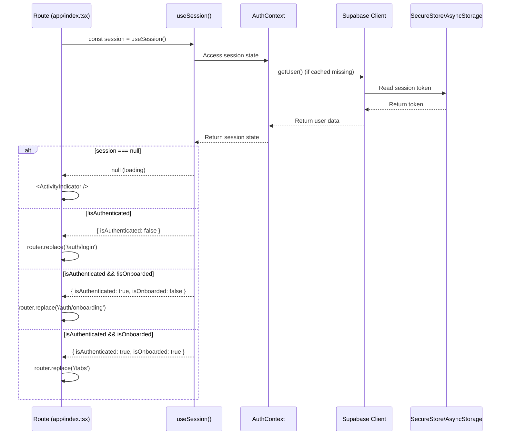

### State Transitions

| 상태 | 조건 | 액션 | 다음 상태 |
|------|------|------|----------|
| `null` | 초기 로딩 중 | `<ActivityIndicator />` | 로딩 완료 시 `{session, user, profile, ...}` 또는 `{session: null, user: null, profile: null, loading: false}` |
| `{ isAuthenticated: false }` | 세션 없음 | `router.replace('/auth/login')` | 로그인 성공 시 `{ isAuthenticated: true, isOnboarded: ? }` |
| `{ isAuthenticated: true, isOnboarded: false }` | 온보딩 안 됨 | `router.replace('/auth/onboarding')` | 온보딩 완료 시 `{ isAuthenticated: true, isOnboarded: true }` |
| `{ isAuthenticated: true, isOnboarded: true }` | 모든 조건 충족 | `router.replace('/tabs')` | 메인 앱 진입 |

### Key Implementation

**File:** `src/auth/useSession.ts`

```typescript
export function useSession() {
  const context = useContext(AuthContext)

  if (context === undefined) {
    throw new Error('useSession must be used within AuthProvider')
  }

  return context.session
}
```

**반환값 타입:**
```typescript
type SessionState = null | {
  session: Session | null
  user: User | null
  profile: UserProfile | null
  loading: boolean
  isAuthenticated: boolean
  isOnboarded: boolean
  signInWithProvider: (provider: 'kakao' | 'naver' | 'google') => Promise<void>
  signOut: () => Promise<void>
  refreshProfile: () => Promise<void>
}
```

---

## 2. OAuth Deep-link Flow

**목적:** OAuth 제공자(Kakao/Naver/Google)에서 인증 후 앱으로 복귀

**진입점:** `app/(auth)/auth/callback.tsx`

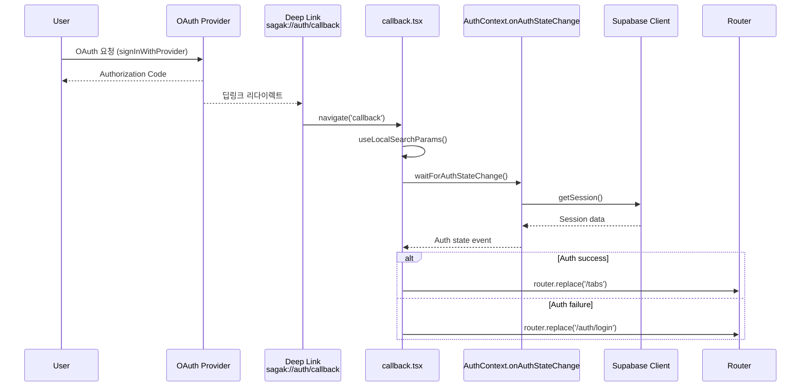

### Key Implementation

**File:** `app/(auth)/auth/callback.tsx`

```typescript
const { accessToken, refreshToken, error } = useLocalSearchParams()

useEffect(() => {
  const waitForAuth = async () => {
    const { data } = await supabase.auth.getSession()
    if (data.session) {
      router.replace('/tabs')
    } else {
      router.replace('/auth/login')
    }
  }
  waitForAuth()
}, [])
```

---

## 3. Book Search Flow (수동 검색)

**목적:** 도서 검색어 → 카카오 책 검색 API → 검색 결과 표시

**진입점:** `app/(tabs)/search.tsx` → `src/features/book/BookSearchScreen.tsx`

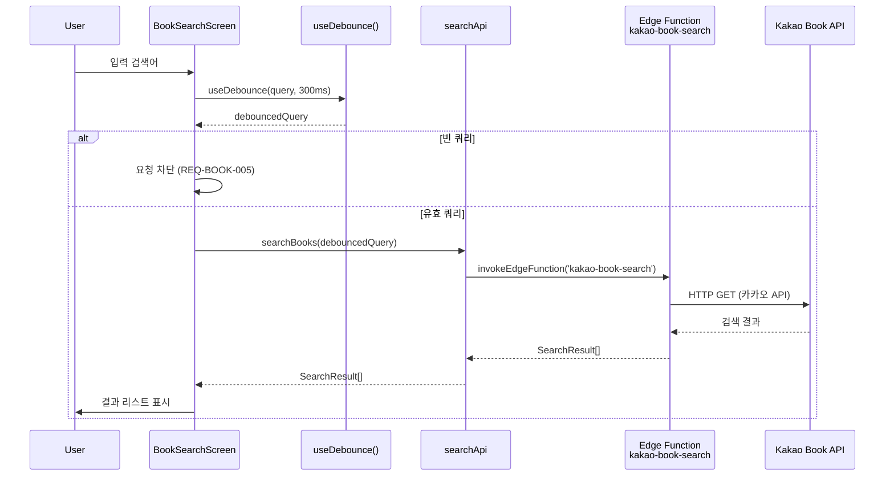

### Key Implementation

**File:** `src/features/book/searchApi.ts`

```typescript
export async function searchBooks(
  query: string,
  target: SearchTarget = 'all'
): Promise<SearchResult[]> {
  if (!query.trim()) {
    return [] // 빈 쿼리 차단 (REQ-BOOK-005)
  }

  const { data, error } = await invokeEdgeFunction('kakao-book-search', {
    query,
    target
  })

  if (error) throw normalizeError(error)
  return data as SearchResult[]
}
```

---

## 4. Barcode Scan Flow (ISBN 스캔)

**목적:** 카메라 → 바코드 스캔 → ISBN 검증 → resolveBookId → 서재 등록 또는 상세 진입

**진입점:** `app/(tabs)/scan.tsx` → `src/features/book/BarcodeScanner.tsx`

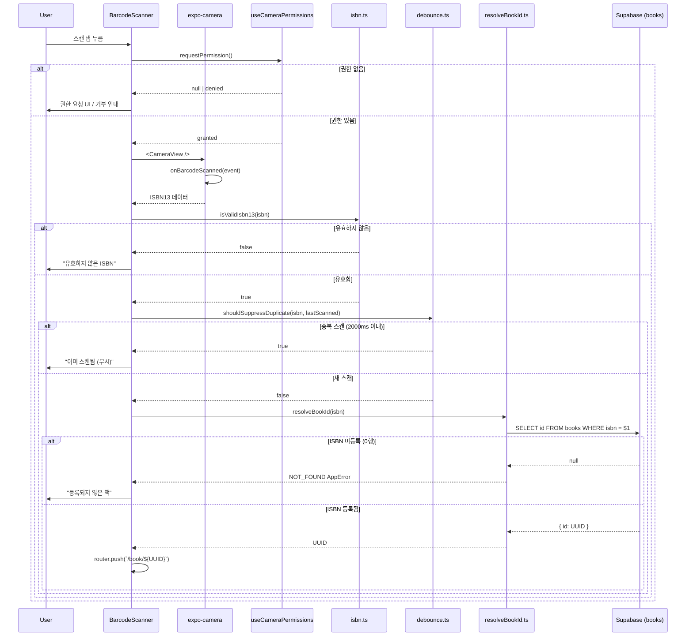

### Key Implementation

**File:** `src/features/book/resolveBookId.ts` (SPEC-LIBRARY-001 TASK-002)

```typescript
export async function resolveBookId(isbn: string): Promise<string> {
  const client = getSupabaseClient()

  const result = await client
    .from('books')
    .select('id')
    .eq('isbn', isbn)
    .maybeSingle()

  if (result.error) throw normalizeError(result.error)
  if (!result.data) {
    throw new AppError(`등록되지 않은 ISBN: ${isbn}`, 'NOT_FOUND', 404)
  }

  return result.data.id
}
```

**특이사항:**
- `maybeSingle()` 사용: 0행 → `data: null` (NOT_ERROR), 1행 → `data: {id}`
- ISBN은 UNIQUE 제약조건이므로 최대 1행 보장
- 미등록 ISBN은 에러가 아닌 "책을 서재에 추가" UI로 연결하는 흐름 (BookDetailScreen)

---

## 5. Book Detail Flow (상세 + 서재 통합)

**목적:** 도서 상세 + 서재 진행률 표시 + 진도/상태 mutation

**진입점:** `app/(tabs)/[bookId].tsx` → `src/features/book/BookDetailScreen.tsx`

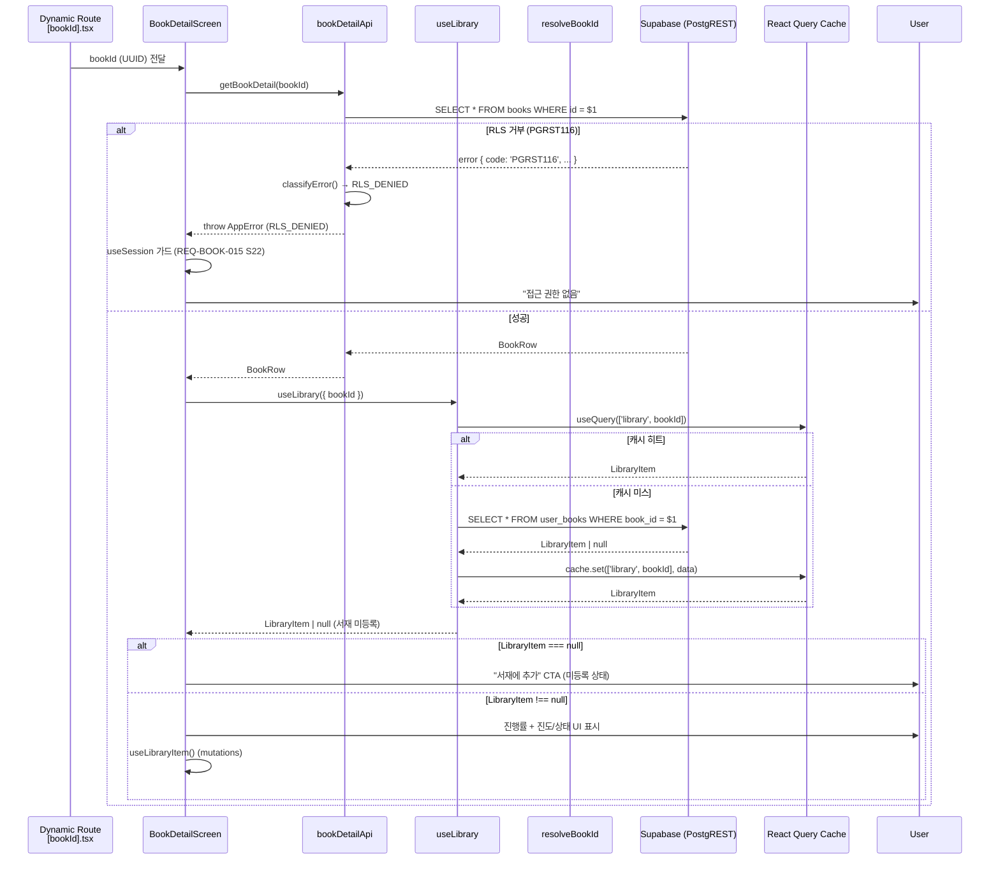

### Key Implementation

**File:** `src/features/book/BookDetailScreen.tsx`

```typescript
const { data: book, isLoading: bookLoading, error: bookError } = useQuery({
  queryKey: ['book', bookId],
  queryFn: () => getBookDetail(bookId),
})

const { data: libraryItem } = useLibrary({
  bookId,
  enabled: !!book, // book 로딩 완료 후 서재 조회
})

const updateProgress = useLibraryItem('progress')
const updateStatus = useLibraryItem('status')
```

**특이사항:**
- `getBookDetail`와 `useLibrary` 병렬 실행 가능하지만, 서재 조회는 `enabled: !!book`으로 book 로딩 완료 후 진행
- `resolveBookId`는 스캔 흐름에서만 호출되고, 여기서는 UUID 직접 사용

---

## 6. Library Mutation Flow (서재 진도/상태 업데이트)

**목적:** 서재 항목의 진도/상태/공개여부 업데이트 + React Query 캐시 무효화

**진입점:** `src/features/library/useLibraryItem.ts`

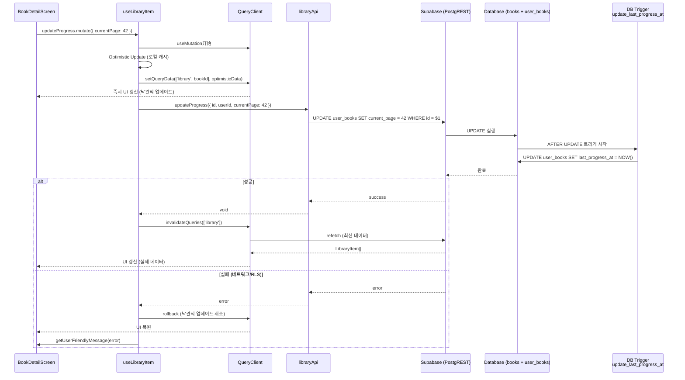

### Key Implementation

**File:** `src/features/library/useLibraryItem.ts`

```typescript
export function useLibraryItem(type: 'progress' | 'status' | 'visibility') {
  const queryClient = useQueryClient()

  return useMutation({
    mutationFn: (input) => {
      switch (type) {
        case 'progress':
          return updateProgress(input)
        case 'status':
          return updateStatus(input)
        case 'visibility':
          return updateVisibility(input)
      }
    },
    onMutate: async (variables) => {
      // Optimistic update
      queryClient.setQueryData(['library', variables.bookId], (old) => ({
        ...old,
        [type === 'progress' ? 'currentPage' : type]: variables.value
      }))
    },
    onError: (error) => {
      // Rollback on error
      queryClient.invalidateQueries(['library'])
    },
    onSuccess: () => {
      // Refetch on success
      queryClient.invalidateQueries(['library'])
    }
  })
}
```

**특이사항:**
- `last_progress_at`은 DB 트리거가 관리하므로, `updateProgress` payload에는 포함하지 않음 (AC-TRIG-001)
- 낙관적 업데이트 실패 시 자동 롤백
- `invalidateQueries(['library'])`로 관련 캐시 무효화

---

## 7. Query Infrastructure Flow (React Query 캐싱)

**목적:** 앱 전역 React Query 싱글톤 → 캐시 공유 + HMR 안정성

**진입점:** `app/_layout.tsx` → `src/lib/query/queryClient.ts`

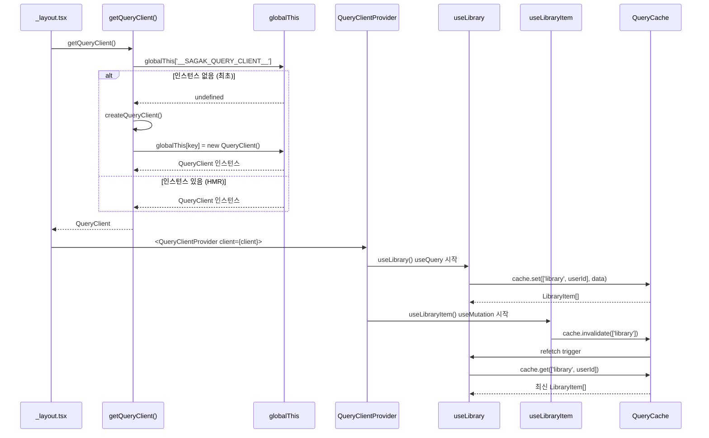

### Key Implementation

**File:** `src/lib/query/queryClient.ts` (SPEC-LIBRARY-001 TASK-001)

```typescript
const QUERY_CLIENT_KEY = '__SAGAK_QUERY_CLIENT__'

export function getQueryClient(): QueryClient {
  const holder = globalThis as QueryClientHolder
  if (!holder[QUERY_CLIENT_KEY]) {
    holder[QUERY_CLIENT_KEY] = createQueryClient()
  }
  return holder[QUERY_CLIENT_KEY]
}

function createQueryClient(): QueryClient {
  return new QueryClient({
    defaultOptions: {
      queries: {
        staleTime: 0, // 즉시 stale (네트워크 우선 전략)
        retry: 1,
        refetchOnWindowFocus: false,
      },
      mutations: {
        retry: 0,
      },
    },
  })
}
```

**특이사항:**
- `globalThis` 캐시로 HMR 중 인스턴스 중복 생성 방지 (TanStack 공식 패턴)
- `staleTime: 0` 설정으로 서재/진행률 데이터는 네트워크 우선 (최신성 중요)
- 테스트용 `resetQueryClient()`로 싱글톤 초기화 지원

---

## 8. gen-types Pipeline Flow (Supabase 타입 자동생성)

**목적:** Supabase DB 스키마 → TypeScript 타입 자동생성 (816행 supabase.ts)

**진입점:** `scripts/gen-types-with-header.js` → `src/types/supabase.ts`

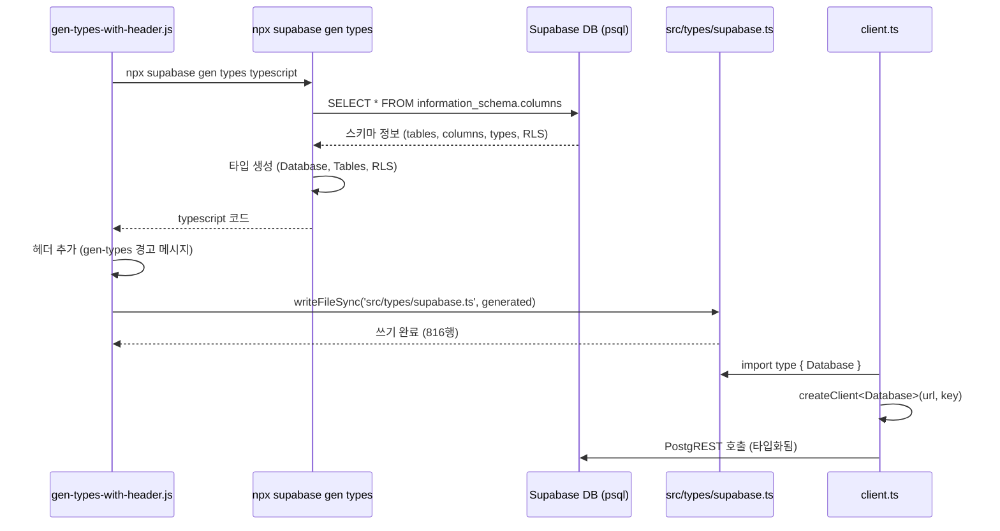

### Key Implementation

**File:** `scripts/gen-types-with-header.js`

```javascript
const { execSync } = require('child_process')
const fs = require('fs')

const header = `/**
 * Supabase 타입 정의 (자동생성됨)
 *
 * 생성 명령어: npx supabase gen types typescript --linked
 * 수정 금지: DB 스키마 변경 시 gen-types-with-header.js 재실행
 */

const generated = execSync('npx supabase gen types typescript --linked').toString()

fs.writeFileSync('src/types/supabase.ts', header + generated)
```

**File:** `src/lib/supabase/client.ts`

```typescript
import type { Database } from '../../types/supabase'
import { createClient } from '@supabase/supabase-js'

export function getSupabaseClient() {
  return createClient<Database>(
    process.env.SUPABASE_URL!,
    process.env.SUPABASE_ANON_KEY!
  )
}
```

**특이사항:**
- `Database` 제네릭으로 PostgREST 쿼리 타입화
- `books.select('id')` → 반환 타입 `{ id: string }[]` 자동 추론
- RLS 정책 타입 포함 (RLS_DENIED 등)

---

## 9. Emotion Record Flow (감정 기록 CRUD)

**목적:** 페이지별 감정 기록 생성/조회/수정/삭제 + 스티커 반응 + 스포일러 필터

**진입점:** `src/features/emotion/EmotionInputScreen.tsx` (입력), `src/features/emotion/TimelineScreen.tsx` (조회)

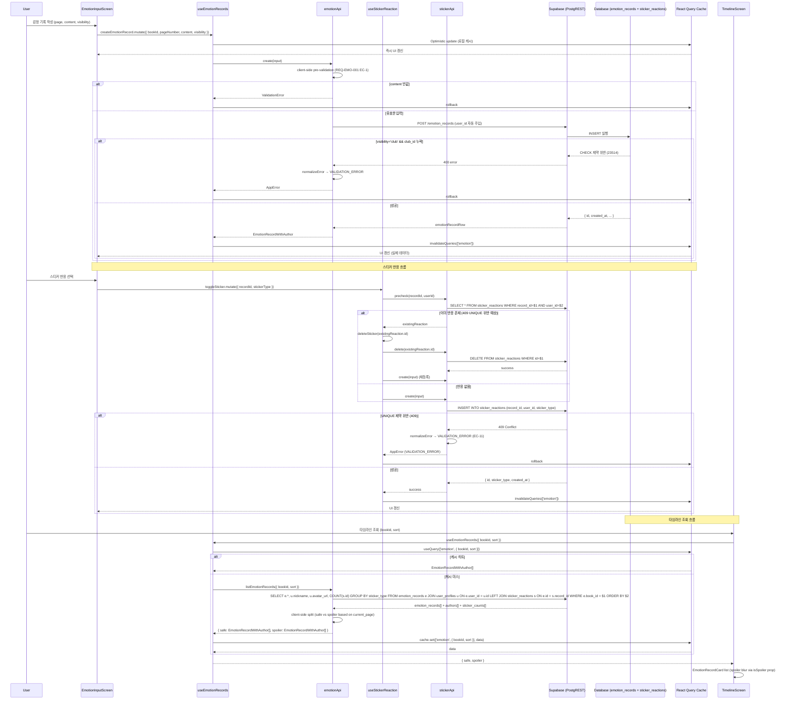

### Key Implementation

**File:** `src/features/emotion/emotionApi.ts`

```typescript
export async function createEmotionRecord(input: CreateInput): Promise<EmotionRecordWithAuthor> {
  // Client-side pre-validation (EC-1)
  if (!input.content.trim()) {
    throw new ValidationError('content', '내용을 입력해주세요')
  }

  const client = getSupabaseClient()
  const { data, error } = await client
    .from('emotion_records')
    .insert({
      book_id: input.bookId,
      page_number: input.pageNumber,
      content: input.content,
      visibility: input.visibility,
      club_id: input.clubId,
      // user_id는 auth.uid()에서 자동 주입됨
    })
    .select('*, user_profiles(nickname, avatar_url)')
    .single()

  if (error) throw normalizeError(error)
  return data
}

export async function listEmotionRecords(params: ListParams): Promise<{ safe: EmotionRecordWithAuthor[], spoiler: EmotionRecordWithAuthor[] }> {
  const client = getSupabaseClient()
  const { data, error } = await client
    .from('emotion_records')
    .select('*, user_profiles(nickname, avatar_url), sticker_reactions(id, sticker_type)')
    .eq('book_id', params.bookId)
    .order(params.sort === 'page' ? 'page_number' : 'created_at', { ascending: params.sort === 'page' })

  if (error) throw normalizeError(error)

  // Client-side split (EC-7, EC-8)
  const safe = data.filter(r => r.page_number <= params.currentPage)
  const spoiler = data.filter(r => r.page_number > params.currentPage)

  // Sticker aggregation (GROUP BY simulation on client)
  const withAggregates = data.map(record => ({
    ...record,
    sticker_counts: {
      empathy: record.sticker_reactions.filter(s => s.sticker_type === 'empathy').length,
      touching: record.sticker_reactions.filter(s => s.sticker_type === 'touching').length,
      comforted: record.sticker_reactions.filter(s => s.sticker_type === 'comforted').length,
    }
  }))

  return { safe: withAggregates.filter(r => r.page_number <= params.currentPage), spoiler: withAggregates.filter(r => r.page_number > params.currentPage) }
}
```

**특이사항:**
- `createEmotionRecord`는 클라이언트 사전 검증(EC-1) 후 PostgREST 직접 호출
- `listEmotionRecords`는 users 조인 + sticker GROUP BY를 클라이언트에서 시뮬레이션 (MVP 단순화)
- 스티커 반응은 409 UNIQUE 위반 시 `normalizeError`가 VALIDATION_ERROR로 매핑(EC-11)

---

## 10. Sticker Reaction Flow (스티커 반응 + 409 처리)

**목적:** 스티커 반응 등록/취소 + 409 UNIQUE 위반 시 업서트 대신 DELETE→POST 재등록 유도

**진입점:** `src/features/emotion/useStickerReaction.ts`

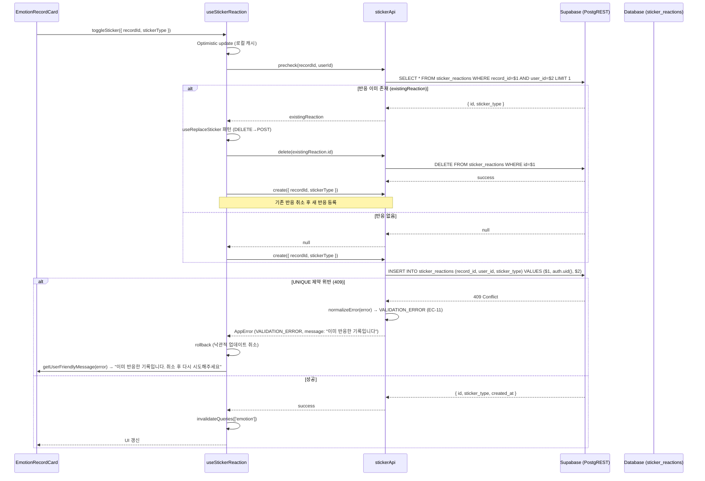

### Key Implementation

**File:** `src/features/emotion/stickerApi.ts`

```typescript
export async function precheckSticker(recordId: string, userId: string): Promise<StickerReaction | null> {
  const client = getSupabaseClient()
  const { data, error } = await client
    .from('sticker_reactions')
    .select('*')
    .eq('record_id', recordId)
    .eq('user_id', userId)
    .maybeSingle()

  if (error) throw normalizeError(error)
  return data
}

export async function createStickerReaction(input: CreateInput): Promise<StickerReaction> {
  const client = getSupabaseClient()
  const { data, error } = await client
    .from('sticker_reactions')
    .insert({
      record_id: input.recordId,
      sticker_type: input.stickerType,
      // user_id는 auth.uid()에서 자동 주입됨
    })
    .select()
    .single()

  if (error) {
    // 409 UNIQUE 위반 시 VALIDATION_ERROR로 매핑 (EC-11)
    const normalized = normalizeError(error)
    if (normalized.code === 'VALIDATION_ERROR') {
      throw new AppError('이미 반응한 기록입니다', 'VALIDATION_ERROR', 409)
    }
    throw normalized
  }
  return data
}
```

**특이사항:**
- UNIQUE `(record_id, user_id)` 위반 시 409 Conflict → VALIDATION_ERROR 매핑
- 업서트(on conflict update) 미사용 — 명시적 DELETE→POST 재등록 유도 패턴
- `precheckSticker`로 기존 반읩 여부 확인 후 `useReplaceSticker` 훅이 DELETE→POST 순서 실행

---

## 11. Completion Report Flow (완독 다이어리 시각화)

**목적:** user_books 완독 → DB 트리거 자동 생성 → completion_reports.report_data 조회 → 6상태 분기 렌더링 (loading/success/empty/error/data-error/auth)

**진입점:** `src/features/completion/CompletionDiaryScreen.tsx`

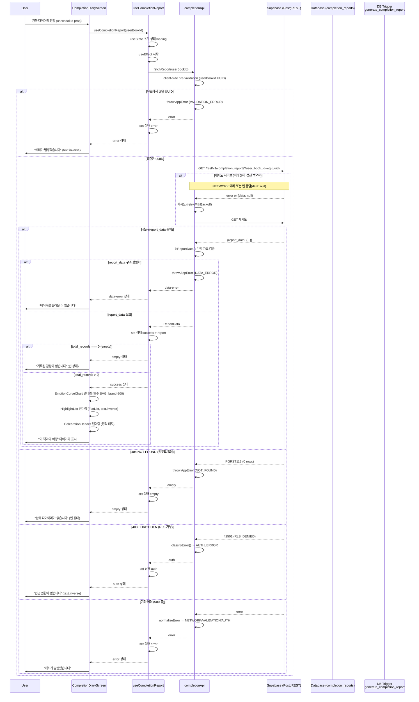

### Key Implementation

**File:** `src/features/completion/completionApi.ts`

```typescript
export async function fetchReport(userBookId: string): Promise<ReportData> {
  // Client-side pre-validation
  if (!isValidUuid(userBookId)) {
    throw new AppError('유효하지 않은 ID입니다', 'VALIDATION_ERROR', 400)
  }

  const client = getSupabaseClient()
  let retries = 0
  const maxRetries = 3

  while (retries < maxRetries) {
    const { data, error } = await client
      .from('completion_reports')
      .select('report_data')
      .eq('user_book_id', userBookId)
      .maybeSingle()

    if (!error && data) {
      // 타입 가드 검증
      if (!isReportData(data.report_data)) {
        throw new AppError('데이터 구조가 올바르지 않습니다', 'DATA_ERROR', 500)
      }
      return data.report_data
    }

    // NETWORK 에러 또는 빈 응답만 재시도
    const normalized = normalizeError(error)
    if (normalized.category === 'network' || (!data && !error)) {
      retries++
      await new Promise(resolve => setTimeout(resolve, Math.pow(2, retries) * 1000))
      continue
    }

    // VALIDATION/AUTH 에러는 즉시 throw
    throw normalized
  }

  throw new AppError('재시도 횟수를 초과했습니다', 'NETWORK_ERROR', 503)
}
```

**특이사항:**
- **재시도 로직**: NETWORK 에러 또는 빈 응답(`data: null, error: null`)만 재시도(최대 3회, 점진 백오프). VALIDATION/AUTH 에러는 즉시 throw.
- **RLS 신뢰**: `user_id` 미전송. RLS 정책(`auth.uid() = user_id`)에 의해 본인 리포트만 자동 필터링.
- **타입 가드**: `isReportData()` 순수 타입 가드로 런타임 검증(Zod 제거, 2026-06-17 결정).
- **6상태 분기**: loading → success/empty/error/data-error/auth. 각 상태별 명확한 UI 분기.

---

---

## 12. Host Clubs Progress Flow (모임 진도 median 집계 + ClubCard 표시)

**목적**: host가 소유한 활성 모임들의 멤버 읽기 진도를 median으로 집계하여 ClubsScreen ClubCard에 표시

**진입점**: `app/(tabs)/clubs.tsx` → `ClubsScreen.tsx` → `useHostClubs`

**Flow**:
1. ClubsScreen 마운트 → useHostClubs 호출
2. Promise.all 병렬: [clubs SELECT(embedded count)] + [get_host_clubs_progress RPC]
3. RPC → PostgreSQL server에서 median 계산 (user_books_public 뷰 소스, current_page>0만)
4. 클라이언트 병합: club_id 기준 Map으로 median_page/member_count_with_progress/progress_total_pages 조인
5. ClubCard 렌더링: ClubProgress 컴포넌트 (median>0+total>0 → 바+텍스트, total=null → 텍스트만)

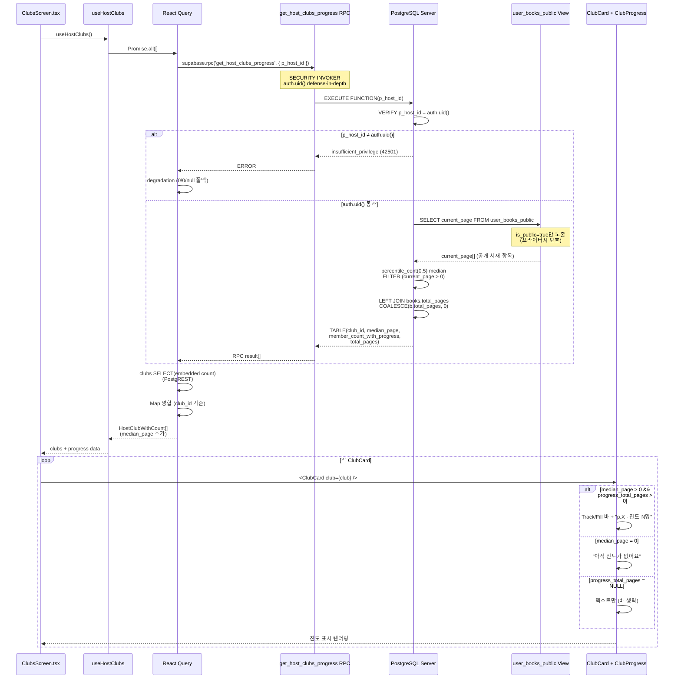

### Key Implementation

**File:** `src/features/club/trackB/hooks.ts`

```typescript
export function useHostClubs() {
  const query = useQuery<HostClubWithCount[]>({
    queryKey: ['clubs', 'host'],
    queryFn: async () => {
      const client = getSupabaseClient()

      // Promise.all 병렬: clubs + RPC
      const [clubsResult, progressResult] = await Promise.all([
        // 1. clubs SELECT (embedded count)
        client
          .from('clubs')
          .select('*, club_members(count)')
          .eq('host_id', client.auth.user()?.id)
          .eq('type', 'group')
          .eq('status', 'active'),

        // 2. RPC 호출 (degradation)
        client.rpc('get_host_clubs_progress', {
          p_host_id: client.auth.user()?.id
        }).catch((error) => {
          // RPC 에러 시 degradation: 진도 필드 0/0/null
          console.error('[useHostClubs] RPC error:', error)
          return [] // 빈 배열 반환 → 기본값 병합
        })
      ])

      // 3. club_id 기준 Map 병합
      const progressMap = new Map(
        progressResult.data?.map(p => [p.club_id, p]) ?? []
      )

      return clubsResult.data?.map(club => ({
        ...club,
        median_page: progressMap.get(club.id)?.median_page ?? 0,
        member_count_with_progress: progressMap.get(club.id)?.member_count_with_progress ?? 0,
        progress_total_pages: progressMap.get(club.id)?.total_pages ?? null
      })) ?? []
    }
  })

  return query
}
```

**RPC 구현 (migration 20240627000001)**:
```sql
CREATE FUNCTION get_host_clubs_progress(p_host_id uuid)
RETURNS TABLE (
  club_id uuid,
  median_page integer,
  member_count_with_progress integer,
  total_pages integer
) LANGUAGE plpgsql SECURITY INVOKER AS $$
BEGIN
  -- Defense-in-depth: auth.uid() 검증
  IF p_host_id IS DISTINCT FROM auth.uid() THEN
    RAISE EXCEPTION 'insufficient_privilege' USING ERRCODE = '42501';
  END IF;

  RETURN QUERY
  SELECT
    c.id AS club_id,
    COALESCE(
      percentile_cont(0.5) WITHIN GROUP (
        ORDER BY ub.current_page
      ) FILTER (WHERE ub.current_page > 0),
      0
    ) AS median_page,
    COUNT(*) FILTER (WHERE ub.current_page > 0) AS member_count_with_progress,
    COALESCE(b.total_pages, 0) AS total_pages
  FROM clubs c
  LEFT JOIN user_books_public ub ON ub.book_id = c.book_id
  LEFT JOIN books b ON b.id = c.book_id
  WHERE c.host_id = p_host_id
    AND c.type = 'group'
    AND c.status = 'active'
  GROUP BY c.id, b.total_pages;
END;
$$;

GRANT EXECUTE ON FUNCTION get_host_clubs_progress(uuid) TO authenticated;
```

### Flow Notes

- **2-라운드트립 최소화**: Promise.all로 clubs SELECT + RPC를 병렬 실행. PostgREST embedded aggregate와 RPC는 동일 쿼리에 혼합 불가능하므로 2회 라운드트립이 최소.
- **Degradation 패턴 (REQ-CLUBC-008)**: RPC 에러 시 전체 useHostClubs 쿼리를 실패시키지 않고, 진도 필드를 기본값(0/0/null)으로 채운 채 clubs+count 데이터만 반환. 진도 표시는 보조 정보이므로 장애가 모임 목록 자체를 사용 불가능하게 만들어서는 안 됨.
- **Defense-in-depth (REQ-CLUBC-002)**: club_members RLS(fn_user_in_club)가 타인 모임을 필터링하나(빈 결과), 단일 방어선 의존을 보강하기 위해 RPC 본문(plpgsql)에 `auth.uid()` 단정문 추가. 타 host_id 호출 시 `insufficient_privilege`(42501) 예외.
- **데이터 소스 일관성 (REQ-CLUBC-004)**: user_books_public 뷰(is_public=true만 노출) 소스 → Track A readersApi.ts와 동일 데이터 소스로 프라이버시 경계 유지. is_public=false인 멤버의 진도는 집계에서 자동 제외.
- **Median 계산 (REQ-CLUBC-003)**: `percentile_cont(0.5)` WITHIN GROUP (ORDER BY current_page) + `FILTER (WHERE current_page > 0)` → 진도 입력 멤버만 median, 0p 멤버 제외. current_page>0 멤버가 없으면 median_page=0.
- **UI 분기 (REQ-CLUBC-010~013)**:
  - `median > 0 && total_pages > 0` → Track/Fill 바 + "p.{median} · 진도 {member_count_with_progress}명"
  - `median = 0` → "아직 진도가 없어요"
  - `total_pages = NULL` → 텍스트만 (바 생략)
- **Token-only 스타일링 (REQ-CLUBC-015)**: spacing[1]/radius.full/brand-500 토큰만 사용, 하드코딩 금지 (SPEC-UI-002).

---

## Data Flow Summary
| Completion Report | `CompletionDiaryScreen` | useCompletionReport, completionApi | Supabase (PostgREST) | useState/useEffect (6상태) |
| Host Clubs Progress | `app/(tabs)/clubs.tsx` | useHostClubs, get_host_clubs_progress RPC | PostgreSQL (RPC) | React Query (Promise.all + degradation) |
