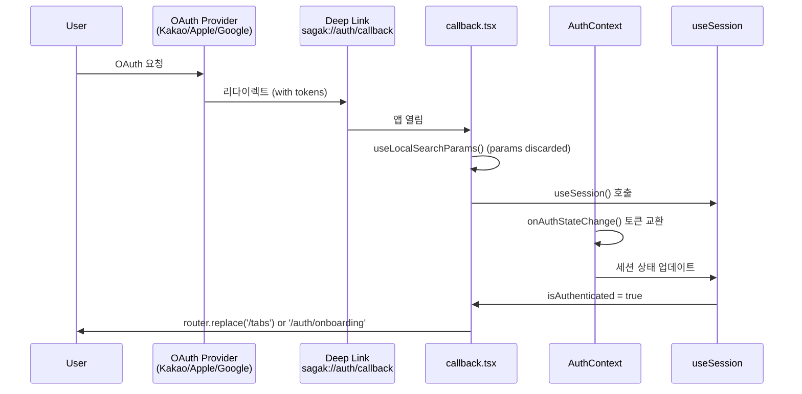

# Sa-gak Entry Points Catalog

진입점 목록 — _layout.tsx 렌더 트리, 앱 시작 경로, 딥링크 진입 경로

## Root Layout Entry Point

### File: `app/_layout.tsx`

**역할:** 루트 레이아웃, 전역 제공자 설정

**렌더 트리:**
```tsx
<ThemeProvider>
  <AuthProvider>
    <Stack screenOptions={{ headerShown: false }}>
      {/* Stack screens */}
    </Stack>
  </AuthProvider>
</ThemeProvider>
```

**제공자 체인:**
1. `ThemeProvider` (`src/theme/theme.tsx`)
   - 전역 테마 상태 제공
   - `useTheme` 훅 노출
   - 라이트/다크 모드 전환

2. `AuthProvider` (`src/auth/AuthContext.tsx`)
   - 전역 인증 상태 제공
   - `useSession` 훅 노출
   - OAuth 토큰 교환 (`onAuthStateChange`)

3. `Stack` (Expo Router)
   - 파일 기반 라우팅
   - 헤더 숨김 (`headerShown: false`)

**의존성:**
```typescript
import { ThemeProvider } from '@/theme/theme'
import { AuthProvider } from '@/auth/AuthContext'
```

---

## App Launch Flow

### Phase 1: App Start → Root Layout

```
App Launch
  ↓
app/_layout.tsx (Root Layout)
  ↓
ThemeProvider initializes
  ↓
AuthProvider initializes
  ↓
Supabase client created (getSupabaseClient)
  ↓
Session restored from SecureStore/AsyncStorage
  ↓
Stack ready
```

### Phase 2: Root Layout → Index Branching

**File:** `app/index.tsx`

**로직:** `useSession()` 기반 분기

```mermaid
graph TD
    A[app/index.tsx] --> B{useSession()}
    B -->|null| C[ActivityIndicator<br/>Loading state]
    B -->|!isAuthenticated| D[Router.replace /auth/login<br/>Redirect to login]
    B -->|isAuthenticated && !isOnboarded| E[Router.replace /auth/onboarding<br/>Redirect to onboarding]
    B -->|isAuthenticated && isOnboarded| F[Router.replace /tabs<br/>Enter main app]
```

**구현:**
```typescript
const session = useSession()

if (session === null) {
  return <ActivityIndicator />
}

if (!session.isAuthenticated) {
  router.replace('/auth/login')
  return null
}

if (!session.isOnboarded) {
  router.replace('/auth/onboarding')
  return null
}

router.replace('/tabs')
return null
```

### Phase 3: Group Layout Guards

#### Tabs Layout (`app/(tabs)/_layout.tsx`)

**가드 로직:**
```typescript
const session = useSession()

if (session === null) {
  return <ActivityIndicator />
}

if (!session.isAuthenticated || !session.isOnboarded) {
  router.replace('/auth/login')
  return null
}

return <TabsLayout />
```

#### Auth Layout (`app/(auth)/_layout.tsx`)

**가드 로직:**
```typescript
const session = useSession()

// 이미 인증/온보딩 완료 시 메인 화면으로
if (session?.isAuthenticated && session.isOnboarded) {
  router.replace('/tabs')
  return null
}

return <AuthStack />
```

---

## Screen Entry Paths

### Main Tabs (인증 + 온보딩 완료 시)

```
app/(tabs)/_layout.tsx
  ↓
4 Tabs available:
  ├── index.tsx (Home)
  ├── library.tsx (Library)
  ├── clubs.tsx (Clubs)
  └── my.tsx (My Page)
```

### Auth Flow (인증 필요 시)

```
app/(auth)/_layout.tsx
  ↓
Auth Stack:
  ├── login.tsx (Login screen)
  ├── onboarding.tsx (Onboarding screen)
  └── auth/callback.tsx (OAuth deep-link callback)
```

### Dynamic Routes

```
app/(tabs)/[bookId].tsx
  ├── Pattern: /tabs/{bookId}
  └── Example: /tabs/123 (Book detail for ID 123)

app/(tabs)/clubs/[clubId].tsx
  ├── Pattern: /tabs/clubs/{clubId}
  └── Example: /tabs/clubs/456 (Club detail for ID 456)
```

---

## Deep-link Entry Path

### OAuth Callback Flow

**딥링크:** `sagak://auth/callback`

**진입 파일:** `app/(auth)/auth/callback.tsx`

**흐름:**


**구현:**
```typescript
export default function CallbackScreen() {
  const router = useRouter()
  const params = useLocalSearchParams()
  // params는 discarded (실제 토큰은 AuthContext.onAuthStateChange에서 처리)

  const session = useSession()
  
  useEffect(() => {
    // AuthContext.onAuthStateChange가 토큰 교환 완료 시
    if (session?.isAuthenticated) {
      if (session.isOnboarded) {
        router.replace('/tabs')
      } else {
        router.replace('/auth/onboarding')
      }
    }
  }, [session, router])

  return <ActivityIndicator />
}
```

**참고:** 딥링크 파라미터(`useLocalSearchParams()`)는 폐기되고, 실제 토큰 교환은 `AuthContext.onAuthStateChange`에서 Supabase Auth listener를 통해 처리됩니다.

---

## Dev Entry Point

### File: `app/_dev.tsx`

**조건:** `__DEV__` 게이트 (개발 전용)

**용도:** 개발 중 컴포넌트 테스트/데모

**진입 조건:**
```typescript
if (__DEV__) {
  // _dev.tsx 접근 가능
}
```

**참고:** 프로덕션 빌드에서는 제외됨

---

## Entry Point Invocation Summary

| 진입점 | 트리거 경로 | 조건 | 다음 단계 |
|-------|-----------|------|----------|
| `app/_layout.tsx` | App launch | 항상 | ThemeProvider → AuthProvider → Stack |
| `app/index.tsx` | Root layout 렌더링 후 | 항상 | useSession() 기반 분기 |
| `/auth/login` | !isAuthenticated | 인증 안 됨 | 로그인 화면 |
| `/auth/onboarding` | isAuthenticated && !isOnboarded | 온보딩 안 됨 | 온보딩 화면 |
| `/tabs` | isAuthenticated && isOnboarded | 인증+온보딩 완료 | 메인 탭 |
| `sagak://auth/callback` | OAuth 리다이렉트 | 딥링크 | 콜백 → useSession → 리다이렉트 |
| `_dev.tsx` | 개발자 접근 | `__DEV__` true | 데모 화면 |
| `POST /functions/v1/kakao-book-search` | Edge Function 호출 | Supabase Edge Function | handleSearchRequest → Kakao API/캐시 → 응답 |

---

## Entry Point Dependency Graph

```mermaid
graph TD
    A[App Launch] --> B[app/_layout.tsx]
    B --> C[ThemeProvider]
    B --> D[AuthProvider]
    C --> E[useTheme available]
    D --> F[useSession available]
    B --> G[app/index.tsx]
    G --> H{useSession state}
    H -->|null| I[ActivityIndicator]
    H -->|!auth| J[app/(auth)/login.tsx]
    H -->|auth&&!onboarded| K[app/(auth)/onboarding.tsx]
    H -->|auth&&onboarded| L[app/(tabs)/_layout.tsx]
    L --> M[4 Tabs Render]
    J --> N[User Signs In]
    N --> O[OAuth Provider]
    O --> P[sagak://auth/callback]
    P --> Q[app/(auth)/auth/callback.tsx]
    Q --> R[AuthContext.onAuthStateChange]
    R --> S[Session Updated]
    S --> G
```

---

**Last Updated:** 2026-06-16  
**Branch:** develop (4424251 → 852f0ac SPEC-BOOK-001 M1+M2 merged)
